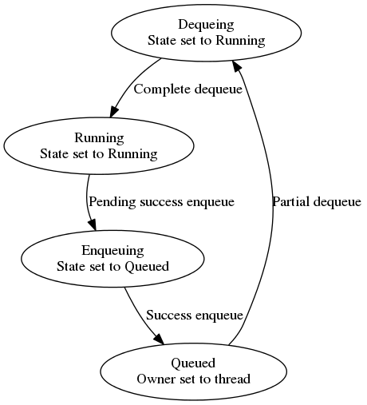

**class Scheduler**

*Fields*

* `Array Threads` - Non-growable list of `Thread`s.
* `Stack IdleThreads` - List of idle `Thread`s.
* `Atomic<int> Processes` - The number of processes associated to scheduler.

```python
SpawnProcess() {
  P <- new Process()
  Processes++
  EnqueueOnAnyThread(P)
}
```

```python
RunThread(T) {
  while True {
    T.IdleMonitor.Lock();
    while T.IsEmpty and Processes > 0 {
      IdleThreads.Push(T)
      T.IdleMonitor.Wait();
    }
    T.IdleMonitor.Unlock();
    if Processes = 0: break
    while True {
      P <- DequeueFromThread(T)
      while P != Null: P <= Execute(P, T)
    }
  }
}
```

```python
Execute(P, T)
  # May call SpawnProcess.
  Interrupt <- Interpret(P)

  if Interrupt = Terminate {
    delete P
    Processes--
    if Process = 0: NotifyAllThreads()
    return Null
  }

  if Interrupt = Yielded {
    P.ChangeState(Running, Yielding)
    if P.IsQueueEmpty {
      P.ChangeState(Yielding, Sleeping)
    } else {
      P.ChangeState(Yielding, Queued)
      EnqueueOnThread(T, P)
    }
    return Null
  }

  if Interrupt = TargetYielded {
    Port = Interrupt.Port
    INVARIANT(Port.IsLocked())
    Target = Port.Target
    if Target.ChangeState(Sleeping, Running) {
      Port.Unlock()
      P.ChangeState(Running, Queued)
      EnqueueOnAnyThread(P)
      return Target
    } else {
      TargetThread <- Target.OwnerThread
      if TargetThread != Null and TargetThread.TryDequeueEntry(Target) {
        Port.Unlock()
        P.ChangeState(Running, Queued)
        EnqueueOnAnyThread(P)
        return Target
      }
    }
    Port.Unlock()
    C.ChangeState(Running, Queued)
    EnqueueOnAnyThread(C)
    return Null
  }
```

```python
NotifyAllThreads()
  for T in Threads: T.Wakeup()
```

```python
EnqueueOnAnyThread(P) {
  if TryEnqueueOnIdleThread(P): return True
  while True {
    for T in Threads {
      Success, WasEmpty <- T.TryEnqueue(P)
      if Success {
        if WasEmpty: T.Wakeup()
        return False
      }
    }
  }
}
```

```python
TryEnqueueOnIdleThread(P) {
  while True {
    T <- IdleThreads.Pop()  # Is really a CAS, linked-list through Threads
    if T = Null: return False
    Success, WasEmpty <- T.TryEnqueue(P)
    if !Success: continue
    T.Wakeup()
    return True
  }
}
```

```python
TryDequeueFromAnyThread() {
  for each T in Threads {
    Success, P <- T.TryDequeue()
    if P != Null: return P;
  }
  return Null;
}
```

```python
DequeueFromThread(T) {
  while True {
    Success, P <- T.TryDequeue()
    if Success: return P
    P <- TryDequeueFromAnyThread()
    if P != Null: return P
  }
}
```

**class Thread**

Each Thread has a queue of scheduled processes, with 3 simple commands:


- `TryEnqueue` - Try to enqueue a Process to the end of the queue.
- `TryDequeue` - Try to dequeue the head element of the queue.
- `TryDequeueEntry` - Try to dequeue a specific P from the queue.

_Fields_

- `Atomic<Process> Head` - Head of queue
- `Atomic<Process> Tail` - Tail/end of queue
- `Process Sentinel` - Non-Null & unique Process value.
- `Monitor IdleMonitor`

_Members_

```python
TryEnqueue(P) {
  INVARIANT(P.State = Queued)
  H <- Head
  while True {
    if H = Sentinel: return False, False
    if Head.CompareAndSwap(H, Sentinel): break
    H <- Head
  }
  P.OwnerThread <- This
  if H != Null {
    Tail.Next <- P
    P.Previous <- Tail
    Tail <- P
    Head <- H
  } else {
    Tail <- P
    Head <- P
  }
  return True, H = Null
}
```

```python
TryDequeue() {
  H <- Head
  while True {
    if H = Sentinel: return False, Null
    if H = Null: return True, Null
    if Head.CompareAndSwap(H, Sentinel): break
    H <- Head
  }
  INVARIANT(H unreachable from other threads)
  if Tail = H: Tail <- Null
  Next <- H.Next
  if next != Null: Next.Previous <- Null
  H.ChangeState(Queued, Running)
  H.OwnerThread <- Null
  H.Next <- Null
  Head <- Next;
  return True, H
}
```

```python
TryDequeueEntry(P)
  H <- Head
  while True {
    if H = Sentinel or H = Null: return False
    if Head.CompareAndSwap(H, Sentinel): break
    H <- Head
  }
  if P.OwnerThread != This or !P.ChangeState(Queued, Running) {
    Head <- H
    return False
  }
  INVARIANT(P unreachable from other threads)
  if H = P {
    if H = Tail: Tail <- Null
    Head <- Head.Next
  } else {
    Next <- P.Next
    Previous <- P.Previous
    Previous.Next <- Next
    if Next = Null {
      Tail <- Prev
    } else {
      Next.Previous <- Previous
    }
  }
  P.OwnerThread <- Null
  P.Next <- Null
  P.Previous <- Null
  Head <- H
  return True
}
```

```python
IsEmpty {
  return Head = Null;
}
```

```python
Wakeup() {
  # The 'value' changed under the lock is an insertion into the queue.
  IdleMonitor.Lock();
  IdleMonitor.Notify();
  IdleMonitor.Unlock();
}
```

```python
Wait() {
  IdleMonitor.Lock();
  while IsEmpty: IdleMonitor.Wait();
  IdleMonitor.Unlock();
}
```

**class Process**

The process transition in state as follows:



*Fields*

- `Atomic<Thread> OwnerThread`
- `Atomic<Process> Next`
- `Atomic<Process> Previous`
- `Atomic<Sleeping|Queued|Running|Yielding> State`
- `Atomic<PortQueue> MessageStack`
- `List<Port> Ports`

```python
~Process() {
  for Port in Ports {
    Port.OwnerProcessTerminating()
  }
}
```

```python
Enqueue(Port, Message) {
  Entry <- new PortQueue(Port, Message)
  while True {
    Last <- MessageStack
    Entry.SetNext(Last);
    if MessageStack.CompareAndSwap(Last, Entry): break
  }
}
```

```python
ChangeState(From, To) {
  if From = Running or From = Yielding {
    INVARIANT(State = From)
    State <- To
    return True
  }
  S <- State
  while True {
    if From = Yielding {
      S <- State
      continue
    }
    if S = From: break;
    if State.CompareAndSwap(S, To): return True
    S <- State
  }
  return False
}
```

**class Port**

*Fields*

- `Atomic<Bool> Locked`
- `Atomic<Int> RefCount`
- `Process Process`

```python
Lock() {
  while True {
    L <- Locked
    if L: continue
    if Lock.CompareAndSwap(L, True): break
  }
}
```

```python
Unlock() {
  Lock <- False
}
```

```python
IsLocked() {
  return Lock
}
```

```python
IncrementRef() {
  INVARIANT(RefCount > 0)
  RefCount++
}
```

```python
DecrementRef() {
  Lock()
  INVARIANT(RefCount > 0)
  RefCount--
  if RefCount = 0 and Process = Null {
    delete This
  } else {
    Unlock()
  }
}
```

```python
OwnerProcessTerminating() {
  Lock()
  if RefCount = 0 {
    delete This
  } else {
    Process <- Null
    Unlock()
  }
}
```

```python
Send(Message) {
  Lock()
  if Process != Null {
    Process.Enqueue(This, Message)
    // When returning something not Null, the current Process will be interrupted
    // with TargetYielded.
    // Note it's returned Locked.
    return This
  }
  Unlock()  
  return Null
}
```
